# Lecture 6: User Interfaces


## Introduction

Lecture 6 shifts focus from backend structure to frontend experience. Up to this point, the course covered:

- HTML and CSS for page structure and styling
- Git/GitHub for version control and collaboration
- Python and Django for server-side web applications
- JavaScript for making pages dynamic

Now the emphasis is user interaction design: making interfaces feel responsive, intuitive, and efficient.

## User Interfaces

A user interface is the layer where people and your application meet. Better UI is not only visual polish; it is also interaction design.

Goals:

- Reduce unnecessary page reloads
- Show fast feedback for user actions
- Keep navigation understandable
- Make transitions between states smooth

This lecture introduces practical patterns that improve perceived speed and usability.

## Single Page Applications (SPA)

Traditional multi-page apps navigate between separate routes and render whole new pages. In a SPA approach, JavaScript updates only the section that changed, while static areas (header/navbar/layout) remain in place.

Why this helps:

- Less repeated rendering
- Faster feeling transitions
- Better control over UI state

### Simple client-side page switching

Basic SPA behavior can be simulated by:

- Creating multiple hidden sections in one HTML document
- Showing only one section at a time based on a button click

Core logic pattern:

```javascript
function showPage(page) {
	document.querySelectorAll("div").forEach(div => {
		div.style.display = "none";
	});
	document.querySelector(`#${page}`).style.display = "block";
}
```

Local image:

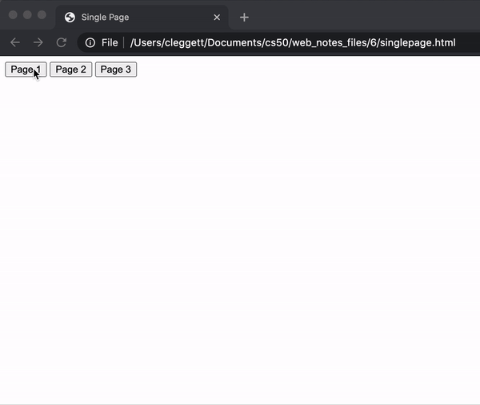

### Fetching section content from the server

Loading every section's full content in advance is inefficient for real apps. A better pattern is:

- Keep shell UI on one page
- Request section content only when needed

In Django, a common structure is:

- Route 1: main template (`index`)
- Route 2: data endpoint (`sections/<int:num>`)

Frontend pattern:

```javascript
function showSection(section) {
	fetch(`/sections/${section}`)
		.then(response => response.text())
		.then(text => {
			document.querySelector("#content").innerHTML = text;
		});
}
```

Local image:

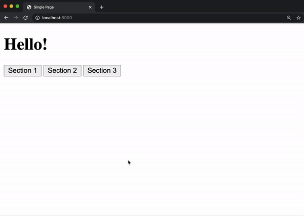

### History API for meaningful URLs

SPA drawback: URL often does not change while content changes.

Use History API:

- `history.pushState(state, title, url)` when user navigates to a section
- `window.onpopstate` to restore previous state when Back/Forward is pressed

Conceptual behavior:

- Click section button -> push new state + update URL + render section
- Browser back button -> read prior state -> rerender matching section

Local image:

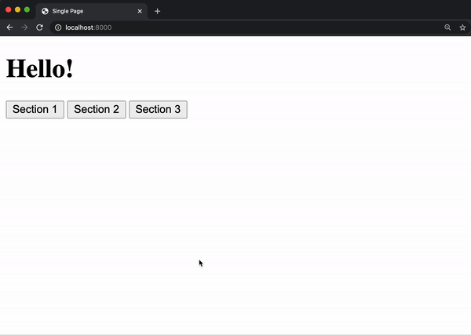

## Scroll

Lecture 6 uses scrolling metrics to detect where users are on a page.

Important values:

- `window.innerWidth`: viewport width
- `window.innerHeight`: viewport height
- `window.scrollY`: vertical scroll amount
- `document.body.offsetHeight`: full document height

Local image:

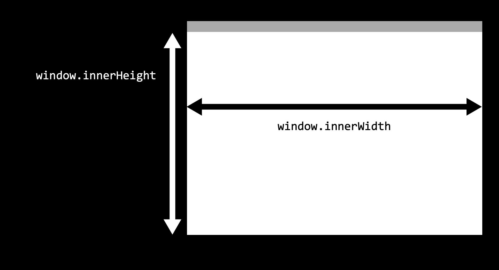

Local image:

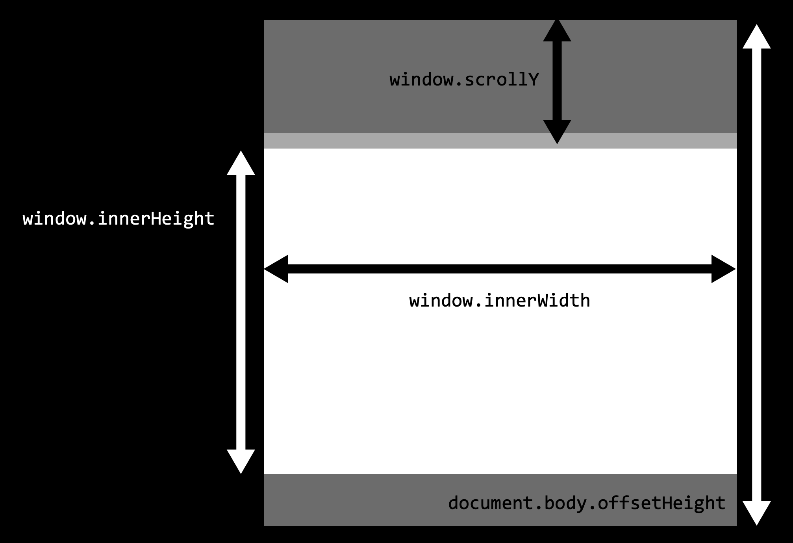

Bottom detection condition:

```javascript
window.innerHeight + window.scrollY >= document.body.offsetHeight
```

Example use: change page background at bottom.

Local image:

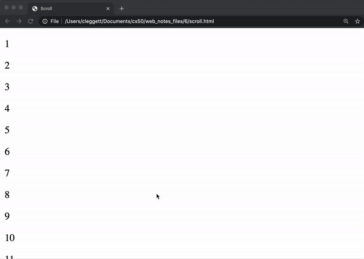

### Infinite Scroll

Instead of loading all posts immediately, load in batches when the user gets near the end.

Backend idea:

- Accept `start` and `end` query parameters
- Return JSON list of posts

Frontend idea:

- Keep a `counter`
- Load initial batch on `DOMContentLoaded`
- On scroll-to-bottom, request next batch and append posts

Core flow:

```javascript
let counter = 1;
const quantity = 20;

document.addEventListener("DOMContentLoaded", load);

window.onscroll = () => {
	if (window.innerHeight + window.scrollY >= document.body.offsetHeight) {
		load();
	}
};

function load() {
	const start = counter;
	const end = start + quantity - 1;
	counter = end + 1;

	fetch(`/posts?start=${start}&end=${end}`)
		.then(response => response.json())
		.then(data => {
			data.posts.forEach(addPost);
		});
}
```

Local image:

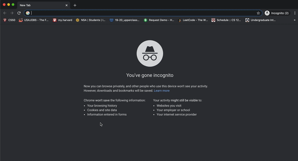

## Animation

CSS animation improves transitions and reduces abrupt UI changes.

### Keyframes

Define animation stages with `@keyframes` using either:

- `from` and `to`
- Percentage steps (`0%`, `50%`, `100%`, etc.)

Common properties:

- `animation-name`
- `animation-duration`
- `animation-fill-mode` (often `forwards`)
- `animation-iteration-count` (`1`, `3`, or `infinite`)
- `animation-play-state` (`running` or `paused`)

Examples shown in lecture:

- Grow heading size
- Move heading left-to-right
- Move out and back with intermediate keyframe

Local image:

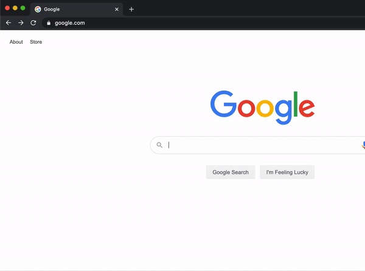

Local image:

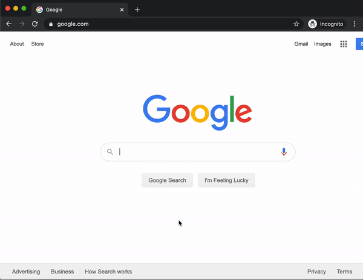

Local image:

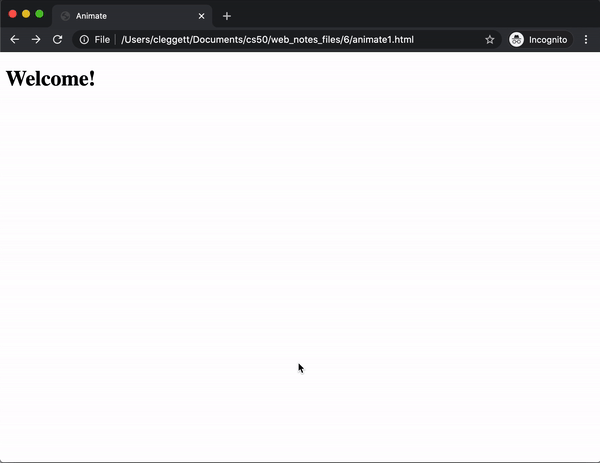

### Controlling animation with JavaScript

You can toggle animation execution with `animationPlayState`:

```javascript
document.querySelector("button").onclick = () => {
	if (h1.style.animationPlayState === "paused") {
		h1.style.animationPlayState = "running";
	} else {
		h1.style.animationPlayState = "paused";
	}
};
```

Local image:

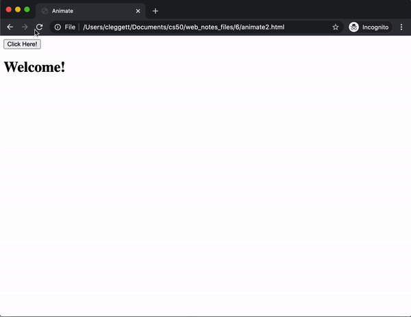

### Hiding posts: instant removal vs animated removal

Initial version:

- Click Hide -> immediately remove element with `remove()`

Local image:

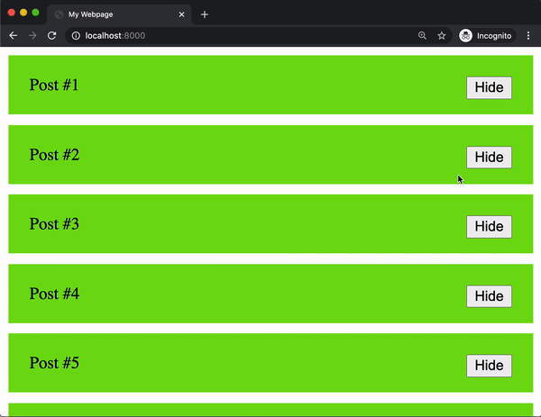

Improved version:

- Add hide keyframe animation that fades then collapses height
- Start animation when Hide is clicked
- Remove element on `animationend`

```javascript
if (element.className === "hide") {
	element.parentElement.style.animationPlayState = "running";
	element.parentElement.addEventListener("animationend", () => {
		element.parentElement.remove();
	});
}
```

Local image:

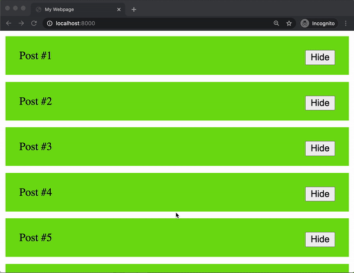

## React

As interfaces grow, manually manipulating DOM becomes repetitive and error-prone.

React introduces a declarative model:

- Describe what UI should look like for current state
- Update state
- React updates DOM automatically

### Imperative vs declarative idea

Imperative style:

- Read current DOM value
- Compute next value
- Write value back to DOM

Declarative style:

- Update state variable
- Render uses that state directly

### Basic React setup in an HTML file

Include libraries:

- React
- ReactDOM
- Babel (for JSX in-browser)

Render root component into one container (`#app`) with `ReactDOM.render`.

Local image:

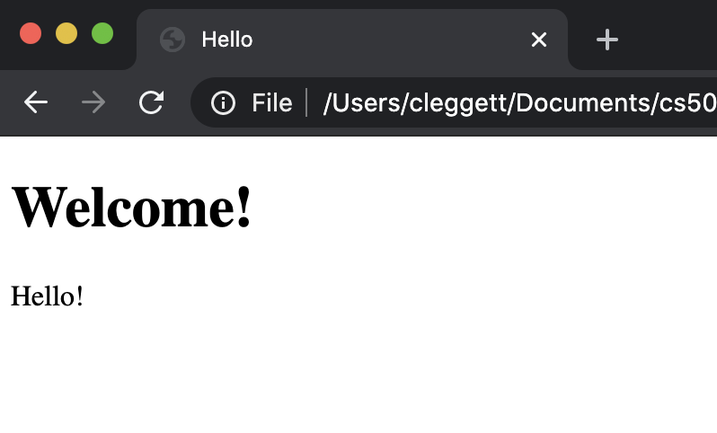

### Components and props

Components are reusable functions that return JSX.

Props allow customizing a component per usage:

```jsx
<Hello name="Harry" />
<Hello name="Ron" />
<Hello name="Hermione" />
```

Inside component:

```jsx
function Hello(props) {
	return <h1>Hello, {props.name}!</h1>;
}
```

Local images:

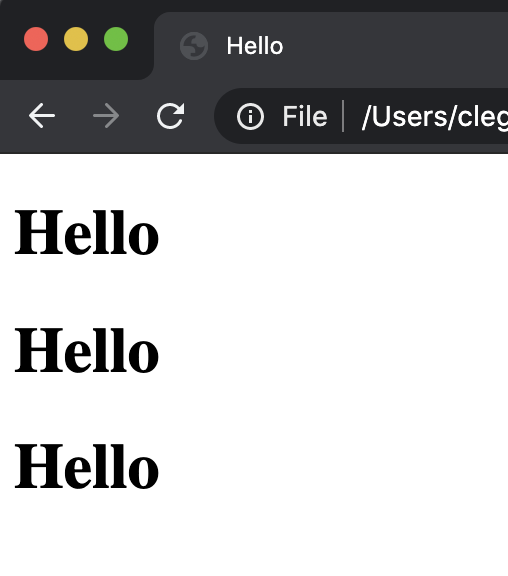

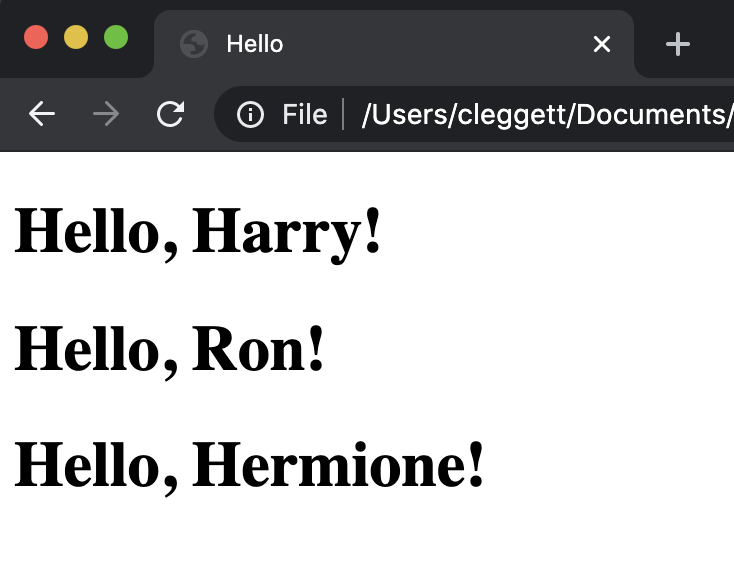

### State and useState hook

`React.useState(initial)` gives:

- Current state value
- Setter to update it

Counter example:

- `const [count, setCount] = React.useState(0)`
- Button click calls `setCount(count + 1)`

Local image:

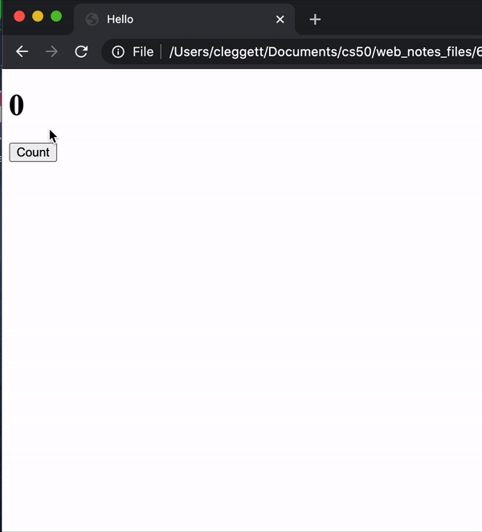

## React Addition App

The lecture culminates in a small game-like app.

### State design

State tracks all changing values:

- `num1`
- `num2`
- `response`
- `score`

```javascript
const [state, setState] = React.useState({
	num1: 1,
	num2: 1,
	response: "",
	score: 0
});
```

### Input handling

- `onChange` updates `response`
- `onKeyPress` checks if Enter was pressed

If answer is correct:

- Increase score
- Generate new random operands
- Clear input

If answer is wrong:

- Decrease score
- Clear input

### Win condition

Render alternate UI when score reaches 10:

```jsx
if (state.score === 10) {
	return <div id="winner">You won!</div>;
}
```

Styling emphasizes:

- Large problem text
- Centered layout
- Prominent winner message

Local images:

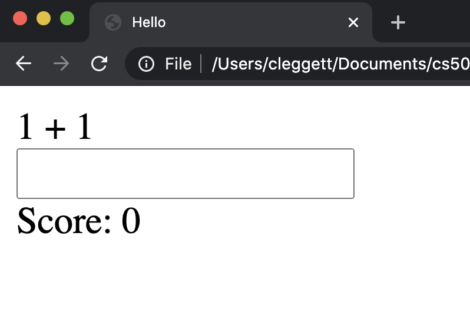

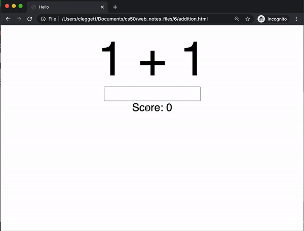

## Final Takeaways

- Smooth UI often means partial updates, not full reloads.
- SPA patterns pair naturally with `fetch` and API-style endpoints.
- Browser history should be managed intentionally in SPA navigation.
- Scroll events enable progressive loading (infinite scroll).
- Animation improves clarity and perceived quality when used purposefully.
- React scales UI development by connecting rendering directly to state.
