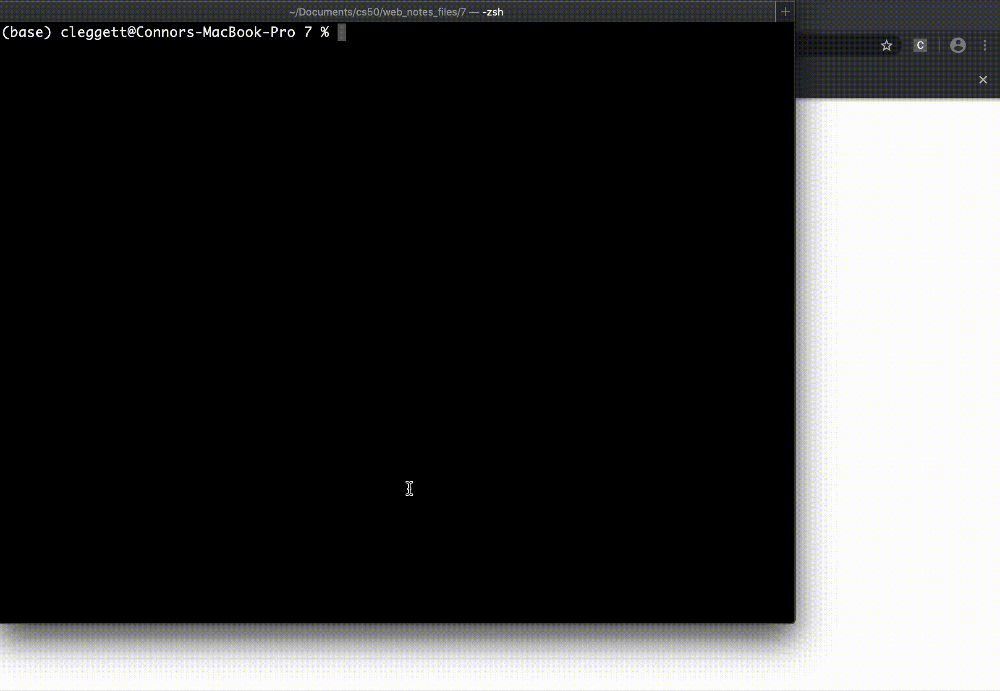
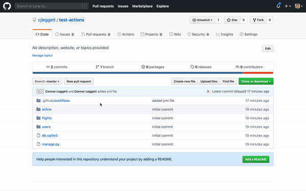
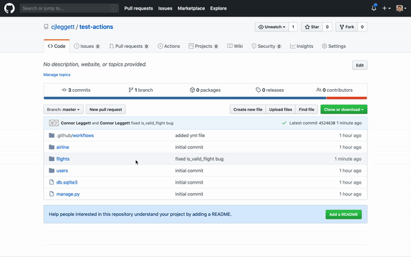

# Lecture 7: Testing, CI/CD, and Docker

## Introduction

So far, the course has covered HTML, CSS, Git and GitHub, Python, Django, JavaScript, animation, and React. Lecture 7 shifts to the practices that help larger projects stay reliable and easier to ship: testing, continuous integration, continuous delivery, and containerization.

## Testing

Testing is the process of checking that code behaves the way we expect it to. As projects grow, testing becomes more important because it helps catch bugs early and prevents new changes from breaking old features.

Useful reasons to test:

- Find bugs before users do
- Confirm that old features still work after changes
- Make refactoring safer
- Support automation in larger projects

## Assert

One of the simplest testing tools in Python is `assert`. If the condition is true, nothing happens. If it is false, Python raises an `AssertionError`.

```python
def square(x):
    return x * x

assert square(10) == 100
```

If the function is wrong, the assertion fails and the program stops with an error.

### Test-Driven Development

Test-driven development means writing tests as you build, or adding a test whenever you fix a bug. The idea is that every bug fix becomes part of the permanent test suite, so the bug is less likely to return later.

Example: testing a prime-checking function.

```python
import math

def is_prime(n):

    # Numbers less than 2 are not prime.
    if n < 2:
        return False

    # Check factors up to the square root of n.
    for i in range(2, int(math.sqrt(n))):

        if n % i == 0:
            return False

    return True
```

Simple test helper:

```python
from prime import is_prime

def test_prime(n, expected):
    if is_prime(n) != expected:
        print(f"ERROR on is_prime({n}), expected {expected}")
```

Running a few values manually can reveal a bug:

```text
>>> test_prime(5, True)
>>> test_prime(10, False)
>>> test_prime(25, False)
ERROR on is_prime(25), expected False
```

The bug comes from stopping the loop too early. The fix is to include the square root itself in the range.

```python
for i in range(2, int(math.sqrt(n)) + 1):
```

## Unit Testing

Python's `unittest` library helps organize many tests into a class and run them automatically.

```python
import unittest
from prime import is_prime

class Tests(unittest.TestCase):

    def test_1(self):
        """Check that 1 is not prime."""
        self.assertFalse(is_prime(1))

    def test_2(self):
        """Check that 2 is prime."""
        self.assertTrue(is_prime(2))

    def test_8(self):
        """Check that 8 is not prime."""
        self.assertFalse(is_prime(8))

    def test_11(self):
        """Check that 11 is prime."""
        self.assertTrue(is_prime(11))

    def test_25(self):
        """Check that 25 is not prime."""
        self.assertFalse(is_prime(25))

    def test_28(self):
        """Check that 28 is not prime."""
        self.assertFalse(is_prime(28))

if __name__ == "__main__":
    unittest.main()
```

What `unittest` shows:

- `.` means a test passed
- `F` means a test failed
- The test name and docstring help identify the failure
- The traceback shows where the assertion failed

After the `range` fix, the test suite passes.

## Django Testing

Django includes a `TestCase` class that creates a separate test database. This protects real data while letting you safely create and destroy temporary objects during tests.

```python
from django.test import TestCase
from .models import Flight, Airport, Passenger
```

### Model Testing

A flight should be valid only if:

1. The origin and destination are different
2. The duration is greater than 0

Example model method:

```python
class Flight(models.Model):
    origin = models.ForeignKey(Airport, on_delete=models.CASCADE, related_name="departures")
    destination = models.ForeignKey(Airport, on_delete=models.CASCADE, related_name="arrivals")
    duration = models.IntegerField()

    def __str__(self):
        return f"{self.id}: {self.origin} to {self.destination}"

    def is_valid_flight(self):
        return self.origin != self.destination and self.duration > 0
```

That `and` is important. Using `or` would incorrectly allow flights that satisfy only one condition.

Test setup commonly uses `setUp()`:

```python
class FlightTestCase(TestCase):

    def setUp(self):

        a1 = Airport.objects.create(code="AAA", city="City A")
        a2 = Airport.objects.create(code="BBB", city="City B")

        Flight.objects.create(origin=a1, destination=a2, duration=100)
        Flight.objects.create(origin=a1, destination=a1, duration=200)
        Flight.objects.create(origin=a1, destination=a2, duration=-100)
```

Example assertions:

```python
def test_departures_count(self):
    a = Airport.objects.get(code="AAA")
    self.assertEqual(a.departures.count(), 3)

def test_arrivals_count(self):
    a = Airport.objects.get(code="AAA")
    self.assertEqual(a.arrivals.count(), 1)
```

And for the validity method:

```python
def test_valid_flight(self):
    a1 = Airport.objects.get(code="AAA")
    a2 = Airport.objects.get(code="BBB")
    f = Flight.objects.get(origin=a1, destination=a2, duration=100)
    self.assertTrue(f.is_valid_flight())

def test_invalid_flight_destination(self):
    a1 = Airport.objects.get(code="AAA")
    f = Flight.objects.get(origin=a1, destination=a1)
    self.assertFalse(f.is_valid_flight())

def test_invalid_flight_duration(self):
    a1 = Airport.objects.get(code="AAA")
    a2 = Airport.objects.get(code="BBB")
    f = Flight.objects.get(origin=a1, destination=a2, duration=-100)
    self.assertFalse(f.is_valid_flight())
```

### Client Testing

`Client` can be used to simulate browser requests and inspect responses.

```python
from django.test import Client, TestCase
```

Typical checks include:

- Response code is 200 for a valid page
- Response code is 404 for a missing page
- Context contains the expected objects

Example:

```python
def test_index(self):

    c = Client()
    response = c.get("/flights/")

    self.assertEqual(response.status_code, 200)
    self.assertEqual(response.context["flights"].count(), 3)
```

## Selenium

Selenium is used for browser automation and client-side testing. It lets Python scripts open a browser, load a page, click buttons, and verify changes in the DOM.

Basic setup:

```python
import os
import pathlib
import unittest

from selenium import webdriver

def file_uri(filename):
    return pathlib.Path(os.path.abspath(filename)).as_uri()

driver = webdriver.Chrome()
```

Example interaction with a counter page:

```python
uri = file_uri("counter.html")
driver.get(uri)

increase = driver.find_element_by_id("increase")
decrease = driver.find_element_by_id("decrease")

increase.click()
increase.click()
decrease.click()
```

Example tests:

```python
class WebpageTests(unittest.TestCase):

    def test_title(self):
        """Make sure title is correct"""
        driver.get(file_uri("counter.html"))
        self.assertEqual(driver.title, "Counter")

    def test_increase(self):
        """Make sure header updated to 1 after 1 click of increase button"""
        driver.get(file_uri("counter.html"))
        increase = driver.find_element_by_id("increase")
        increase.click()
        self.assertEqual(driver.find_element_by_tag_name("h1").text, "1")

    def test_decrease(self):
        """Make sure header updated to -1 after 1 click of decrease button"""
        driver.get(file_uri("counter.html"))
        decrease = driver.find_element_by_id("decrease")
        decrease.click()
        self.assertEqual(driver.find_element_by_tag_name("h1").text, "-1")

    def test_multiple_increase(self):
        """Make sure header updated to 3 after 3 clicks of increase button"""
        driver.get(file_uri("counter.html"))
        increase = driver.find_element_by_id("increase")
        for i in range(3):
            increase.click()
        self.assertEqual(driver.find_element_by_tag_name("h1").text, "3")
```

When a Selenium test fails, the browser can visually show the bug. The lecture includes this example of a failed run:



## CI/CD

CI/CD stands for Continuous Integration and Continuous Delivery.

### Continuous Integration

- Merge often to the main branch
- Run automated tests with each merge
- Catch integration problems early

### Continuous Delivery

- Release often in small increments
- Reduce the risk of large, disruptive updates
- Make it easier to isolate issues after deployment

Benefits of CI/CD:

- Fewer surprises when code is combined
- Easier debugging when tests fail
- Faster feedback for the team
- More reliable releases

## GitHub Actions

GitHub Actions lets a repository run workflows automatically when events happen, such as a push.

Example workflow file:

```yaml
name: Testing
on: push

jobs:
  test_project:
    runs-on: ubuntu-latest
    steps:
      - uses: actions/checkout@v2
      - name: Run Django unit tests
        run: |
          pip3 install --user django
          python3 manage.py test
```

Important pieces:

- `name` gives the workflow a label
- `on` defines what event triggers it
- `jobs` defines the work to do
- `runs-on` picks the GitHub virtual machine
- `steps` lists the actions in order
- `uses` points to an existing GitHub action
- `run` executes shell commands on the runner

Relevant repository tabs:

- Code
- Issues
- Pull Requests
- GitHub Actions

Example failure and recovery in GitHub Actions:





## Docker

Docker creates isolated containers so a project can run in the same environment across different machines.

Why it matters:

- Avoids local machine differences
- Helps standardize development and deployment
- Works well with multiple services

Example `Dockerfile`:

```dockerfile
FROM python:3
COPY .  /usr/src/app
WORKDIR /usr/src/app
RUN pip install -r requirements.txt
CMD ["python3", "manage.py", "runserver", "0.0.0.0:8000"]
```

Key ideas:

- `FROM` chooses a base image
- `COPY` adds project files to the container
- `WORKDIR` sets the working directory
- `RUN` installs dependencies
- `CMD` defines the startup command

Example `docker-compose.yml`:

```yaml
version: '3'

services:
    db:
        image: postgres

    web:
        build: .
        volumes:
            - .:/usr/src/app
        ports:
            - "8000:8000"
```

This setup runs a database container and a web container together. The web app can talk to the database while keeping the environment reproducible.

Useful commands:

- `docker-compose up`
- `docker ps`
- `docker exec -it CONTAINER_ID bash -l`

## Lecture Summary

- Test early and test often
- Use `assert` for small checks
- Use `unittest` for structured Python tests
- Use Django `TestCase` for model and view testing
- Use Selenium for browser automation
- Use GitHub Actions for continuous integration
- Use Docker to standardize the runtime environment
